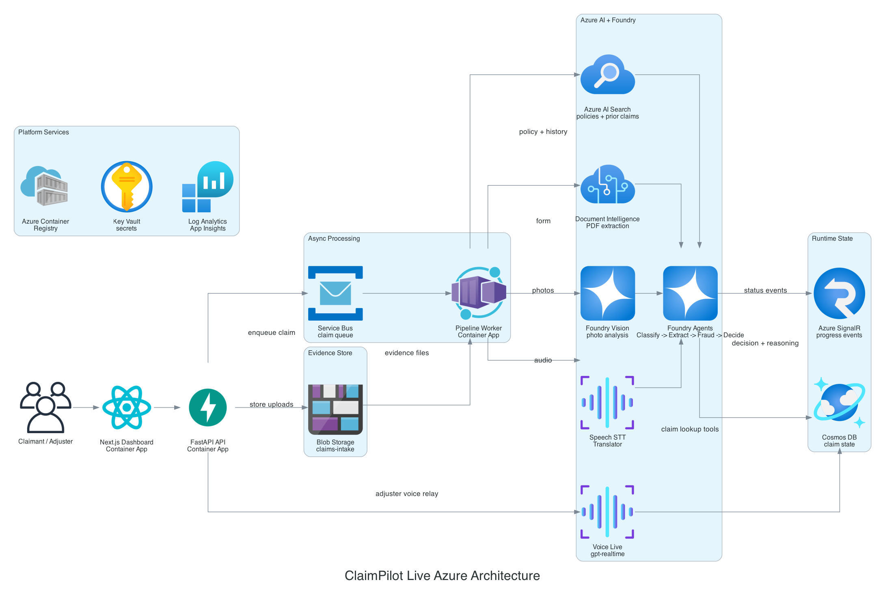

# ClaimPilot — AI-Powered Insurance Claims Autopilot

> **Production-grade multimodal claims processing system** built on Azure AI Foundry, using Document Intelligence, Content Understanding, Azure Speech (STT + Voice Live), Azure Translator, and Foundry Agent Service to automate auto physical damage claim adjudication end-to-end.

[](https://ai.azure.com)
[](https://learn.microsoft.com/azure/ai-foundry/agents)
[](https://python.org)
[](https://nextjs.org)
[](LICENSE)

---

## What This Is

ClaimPilot is a reference implementation of a full-stack, multi-agent insurance claims processing system. It ingests **multimodal evidence** — scanned forms, accident photos, claimant voice statements in any language — and produces a **traceable adjudication decision** with every output linked to its source evidence.

This is not a dashboard wrapper around Azure OpenAI. It is a production-grade agentic pipeline that demonstrates:

- Multi-agent orchestration with Foundry Agent Service (GA as of March 2026)
- Real document processing with Azure AI Document Intelligence custom models trained on ACORD forms
- Visual evidence analysis with Azure AI Content Understanding, with Foundry Vision (GPT-4o) fallback
- Real-time voice adjuster interface via Azure Speech Voice Live API + MCP tool integration
- Human-in-loop escalation with confidence-gated routing
- Full observability via AgentOps tracing on every agent step
- Async pipeline pattern (202-accepted + polling) via FastAPI on Azure Container Apps

**Vertical scope:** Auto physical damage claims only. One line of business, done properly.

### Implementation Status

| Phase | Description | Status |
|---|---|---|
| Phase 1 | Foundation & Ingestion (Doc Intelligence, Content Understanding / Foundry Vision, Speech STT, Translator) | Done |
| Phase 2 | Pipeline + Dashboard (FastAPI, Cosmos DB, SignalR, Next.js dashboard) | Done |
| Phase 3 | Foundry Agents (4 real agent classes, rate-limit retry, Azure Search, tracing, extraction eval) | Done |
| Phase 4 | Voice Live Interface (adjuster copilot, MCP adapter, claim lookup tools) | Done |
| Phase 5 | Frontend Polish, Evaluation, Live Azure Validation, README | Done |
| — | **v1.0.2 released** — Active development complete | **Released** |

---

## Architecture Overview



This diagram is generated with [`mingrammer/diagrams`](https://github.com/mingrammer/diagrams) from
`docs/architecture/claimpilot_live_architecture.py`. It reflects the v1.0.2 live validation deployment: Next.js and
FastAPI on Azure Container Apps, Service Bus worker orchestration, Azure AI Foundry agents, Voice Live, Document
Intelligence, Foundry Vision image analysis, Azure AI Search, Cosmos DB state, SignalR progress events, and platform
services. Durable Functions remains the target production orchestrator; Container Apps is the live-validation adapter
used for this subscription.

```
┌─────────────────────────────────────────────────────────────────────┐
│                         INGESTION LAYER                             │
│                                                                     │
│  Claim Form (PDF/scan)  →  Azure Doc Intelligence (prebuilt-layout)│
│  Accident Photos        →  Content Understanding / Foundry Vision   │
│  Voice Statement        →  Azure Speech STT  →  Azure Translator    │
│                                    ↓                                │
└────────────────────────────────────┬────────────────────────────────┘
                                     │
┌────────────────────────────────────▼────────────────────────────────┐
│                    ORCHESTRATION LAYER                              │
│            FastAPI on Azure Container Apps                          │
│                  Azure AI Foundry Agent Service                     │
│                                                                     │
│  ┌──────────────────┐   ┌──────────────────┐   ┌────────────────┐  │
│  │  Classifier      │   │  Extractor       │   │  Fraud         │  │
│  │  Agent           │──▶│  Agent           │──▶│  Detection     │  │
│  │                  │   │                  │   │  Agent         │  │
│  └──────────────────┘   └──────────────────┘   └───────┬────────┘  │
│                                                         │           │
│  ┌──────────────────────────────────────────────────────▼────────┐  │
│  │              Decision & Reasoning Agent (GPT-4o)              │  │
│  │   Approve / Escalate / Reject  +  Traceable evidence chain    │  │
│  └───────────────────────────────────────────────────────────────┘  │
└─────────────────────────────────────────────────────────────────────┘
                                     │
┌────────────────────────────────────▼────────────────────────────────┐
│                      INTERFACE LAYER                                │
│                                                                     │
│  Voice Live API + Claim Lookup Tools  →  Adjuster voice copilot    │
│  Photo Avatar                         →  Customer status bot       │
│  Next.js + SignalR                    →  Real-time dashboard        │
│  Adjuster Queue                       →  Escalated claims queue    │
└─────────────────────────────────────────────────────────────────────┘
                                     │
┌────────────────────────────────────▼────────────────────────────────┐
│                    OBSERVABILITY LAYER                              │
│  AgentOps tracing  │  Azure Monitor  │  Cosmos DB claim state      │
└─────────────────────────────────────────────────────────────────────┘
```

---

## Tech Stack

### Azure AI Services

| Service | Role in Pipeline | SDK / API |
|---|---|---|
| **Azure AI Document Intelligence** | Extract structured fields from ACORD claim forms (custom neural model) | `azure-ai-documentintelligence` |
| **Azure AI Content Understanding** | Analyze accident images + cross-file reasoning over mixed evidence | `azure-ai-contentsafety` + Content Understanding REST |
| **Azure Speech — STT** | Transcribe claimant voice statements with speaker diarization | `azure-cognitiveservices-speech` |
| **Azure Speech — Voice Live API** | Real-time speech-to-speech adjuster copilot interface | Voice Live WebSocket SDK (Python + C#) |
| **Azure Speech MCP Server** | Exposes speech capabilities as tools to Foundry agents | MCP endpoint at `mcp.ai.azure.com` |
| **Azure Translator** | Normalize non-English voice transcripts before processing | `azure-ai-translation-text` |
| **Azure AI Foundry Agent Service** | Multi-agent orchestration: classify → extract → detect → decide | `azure-ai-projects` v2 (GA) |
| **Foundry IQ (Azure AI Search)** | Policy database lookup + cross-claim pattern retrieval | `azure-search-documents` |
| **Azure AI Foundry (GPT-4o)** | Decision reasoning with traceable source grounding | `azure-ai-projects` inference client |

### Backend

| Tool | Version | Purpose |
|---|---|---|
| **Python** | 3.11+ | Agent pipeline, API layer, all Azure SDK calls |
| **Azure Durable Functions** | Flex Consumption (Python v2) | Target: async pipeline orchestration — 202-accepted pattern |
| **Azure Container Apps** | Consumption | Current: production hosting adapter (Durable Functions blocked by subscription quota) |
| **FastAPI** | 0.115+ | API server + pipeline orchestration (runs on Container Apps) |
| **Azure Cosmos DB** | NoSQL (serverless) | Claim state store: step status, extracted fields, agent outputs |
| **Azure Blob Storage** | Hot tier | Raw document + image ingestion bucket |
| **Azure Service Bus** | Standard | Queue between ingestion and orchestration layers |
| **Azure SignalR Service** | Serverless | Real-time step progress events to frontend |
| **Azure Key Vault** | — | Secrets: API keys, connection strings (never in code) |
| **Azure Application Insights** | — | Distributed tracing, latency telemetry |

### Frontend

| Tool | Version | Purpose |
|---|---|---|
| **Next.js** | 15 (App Router) | Dashboard: claim submission, real-time pipeline status, decision viewer |
| **TypeScript** | 5.x | Type-safe API client, component layer |
| **Tailwind CSS** | 4.x | Styling |
| **Shadcn/ui** | latest | Component primitives |
| **@microsoft/signalr** | 8.x | Real-time step event subscription |
| **React Query (TanStack)** | v5 | Server state, polling fallback |

### Infrastructure & DevOps

| Tool | Purpose |
|---|---|
| **Azure Bicep** | Infrastructure-as-code for all Azure resources |
| **GitHub Actions** | CI/CD: lint, test, Bicep validation, deploy to Azure |
| **Docker** | Local dev containers matching Flex Consumption runtime |
| **pytest** | Agent unit tests + integration test suite |
| **Azure AI Evaluation SDK** | Ground-truth accuracy evaluation on extraction and fraud detection |

---

## Repository Structure

```
claimpilot/
├── README.md
├── CHANGELOG.md
├── LICENSE
├── .env.example
├── pyproject.toml
│
├── infra/                          # Azure Bicep IaC
│   ├── main.bicep
│   ├── modules/                    # 12 modules + RBAC
│   └── parameters/dev.bicepparam
│
├── backend/
│   ├── core/
│   │   ├── config.py               # pydantic-settings (all Azure endpoints + model IDs + image_analysis_provider)
│   │   └── tracing.py              # AgentOps / App Insights tracing
│   │
│   ├── models/
│   │   ├── ingestion.py            # DocumentField, ImageAnalysisResult, VoiceTranscript
│   │   ├── claim.py                # ClaimRecord, PipelineStep, agent output models (8 steps)
│   │   └── voice_live.py           # Voice Live session, event, avatar models
│   │
│   ├── agents/                     # Foundry Agent definitions
│   │   ├── base.py                 # FoundryAgentClient: JSON parsing + rate-limit retry (3 retries, 5s/10s/20s)
│   │   ├── classifier_agent.py     # Claim type + routing confidence
│   │   ├── extractor_agent.py      # Structured field extraction + validation
│   │   ├── fraud_agent.py          # Multi-signal fraud risk scoring
│   │   └── decision_agent.py       # Traceable adjudication with reasoning chain
│   │
│   ├── services/
│   │   ├── document_intelligence.py   # Doc Intelligence: begin_analyze_document + markdown output
│   │   ├── content_understanding.py   # Content Understanding: httpx REST + schema-driven image analysis
│   │   ├── foundry_vision.py          # GPT-4o vision fallback for image analysis (when CU unavailable)
│   │   ├── speech.py                  # Speech STT (azure-cognitiveservices-speech + auto-detect)
│   │   ├── translator.py              # Azure Translator with English passthrough
│   │   ├── search.py                  # Azure AI Search (policies + claims-history indexes)
│   │   ├── claim_state_store.py       # Cosmos DB persistence (with decision_result support)
│   │   ├── evidence_validator.py      # Validates extracted fields against submitted data
│   │   ├── claim_lookup_tool.py       # Voice Live tool: claim data from Cosmos
│   │   ├── voice_live.py              # Voice Live WebSocket session service
│   │   ├── signalr.py                 # Real-time pipeline step events
│   │   └── blob_storage.py            # File upload + download_blob_to_temp
│   │
│   ├── mcp/
│   │   └── claim_server.py         # MCP-compatible claim lookup adapter
│   │
│   ├── pipeline/
│   │   ├── orchestrator.py         # 8-step async pipeline with real agent activities + service wiring
│   │   └── activities/             # classification, extraction, fraud_detection, reasoning
│   │
│   ├── api/
│   │   ├── app.py                  # FastAPI application factory
│   │   ├── routes.py               # POST /claims + GET /claims/{id}/status
│   │   └── adjuster_routes.py      # Session URL, WebSocket relay, queue, claim context
│   │
│   └── domains/auto_damage/        # JSON-driven domain config
│
├── frontend/                       # Next.js 15 App Router
│   ├── src/
│   │   ├── app/
│   │   │   ├── page.tsx            # Claim submission
│   │   │   ├── claims/[claimId]/   # Claim detail + pipeline status + decision viewer
│   │   │   └── adjuster/
│   │   │       ├── [claimId]/      # Voice Live adjuster session
│   │   │       └── queue/          # Escalated claims queue
│   │   ├── components/
│   │   │   ├── ClaimUploadForm.tsx
│   │   │   ├── ClaimStatusPage.tsx
│   │   │   ├── PipelineTracker.tsx
│   │   │   ├── DecisionViewer.tsx
│   │   │   └── voice-adjuster.tsx
│   │   └── lib/
│   │       ├── api.ts
│   │       └── signalr.ts
│
├── evaluation/
│   ├── generate_acord_synthetic.py # 50 PDFs + ground-truth JSON + 20 training samples
│   ├── generate_search_fixtures.py # 50 policies + 100 claims history records
│   ├── evaluate_extraction.py      # Field-level F1 against ACORD ground truth
│   ├── evaluate_fraud.py           # Fraud detection precision/recall
│   ├── evaluate_decision.py        # Decision groundedness metrics
│   ├── run_full_evaluation.py      # Combined report → results/latest.json
│   ├── datasets/
│   │   ├── acord_synthetic/        # forms/, labels/, training/
│   │   └── search_fixtures/        # policies.json, claims_history.json
│   └── results/latest.json
│
├── scripts/                        # CLI smoke tests + deployment helpers
│   ├── analyze_document.py         # DocumentIntelligenceService smoke test
│   ├── analyze_image.py            # ContentUnderstandingService smoke test
│   ├── transcribe_audio.py         # SpeechService smoke test
│   ├── translate_text.py           # TranslatorService smoke test
│   ├── smoke_claim_validation_cases.py  # Live validation: 5 scenarios against deployed API
│   ├── smoke_adjuster_websocket.py      # Live validation: Voice Live WebSocket smoke test
│   ├── generate_demo_assets.py          # Generate deterministic demo data pack
│   ├── download_demo_damage_photos.py   # Download licensed damage photos for demo
│   ├── setup_foundry_agents.py          # Create Foundry agent definitions
│   └── train_doc_intelligence_acord1.py # Training helper with validation
│
├── demo_assets/                    # Deterministic demo data: claim_001 (approve), claim_002 (escalate), claim_003 (fraud)
│
├── docs/deployment/                # Container Apps live validation docs
│
└── tests/
    ├── unit/                       # 264 mocked tests (no Azure calls required)
    └── integration/                # Live tests (RUN_AZURE_INTEGRATION=1)
```

---

## The 8-Stage Pipeline — Deep Dive

### Stage 1 — Multimodal Ingestion

**Trigger:** File upload to Azure Blob Storage (`claims-intake` container).

**What happens:**

1. Blob trigger fires Azure Durable Functions orchestrator via starter function.
2. **Claim form (PDF/scan):** Routed to Azure AI Document Intelligence custom neural model trained on ACORD 1 (personal auto) and ACORD 2 (private passenger auto) forms. Outputs structured Markdown preserving tables and layout.
3. **Accident photos:** Routed to Azure AI Content Understanding with a pre-defined image analysis schema — extracts vehicle damage indicators, visible make/model/color, environmental conditions, license plate if visible. When Content Understanding is unavailable (subscription limitations), **Foundry Vision** provides a GPT-4o vision fallback via chat completions with image URL content blocks. Configurable via `IMAGE_ANALYSIS_PROVIDER`.
4. **Voice statement (any language):** Routed to Azure Speech STT with speaker diarization enabled and semantic VAD for noisy audio environments. If detected language is not English, output is sent to Azure Translator before downstream processing.

**Key technical decision:** Content Understanding handles cross-file reasoning — it can take both the claim form Markdown and the image analysis output together and produce a unified evidence summary. This is the "pro mode" multi-input capability from the `2025-05-01-preview` API. When Content Understanding is unavailable, Foundry Vision (GPT-4o) provides reliable single-image analysis with the same output schema.

```python
# services/content_understanding.py — single image analysis
async def analyze_accident_image(self, image_url: str) -> ImageAnalysisResult:
    response = await self._httpx_client.post(
        f"{self._endpoint}/contentunderstanding/analyzers/{analyzer_id}/analyze",
        json={"url": image_url},
    )
    return ImageAnalysisResult(**response.json()["result"])

# services/foundry_vision.py — GPT-4o vision fallback
async def analyze_accident_image(self, image_url: str) -> ImageAnalysisResult:
    client = self._get_openai_client()
    def _call() -> ImageAnalysisResult:
        response = client.chat.completions.create(
            model=self._model_deployment,
            messages=[
                {"role": "system", "content": VISION_SYSTEM_PROMPT},
                {"role": "user", "content": [
                    {"type": "image_url", "image_url": {"url": image_url}},
                    {"type": "text", "text": "Analyze this vehicle damage photo..."},
                ]},
            ],
            max_tokens=2000, temperature=0.1,
        )
        return ImageAnalysisResult(**json.loads(response.choices[0].message.content))
    return await asyncio.to_thread(_call)
```

---

### Stage 2 — Classification + Routing

**Agent:** `ClassifierAgent` (Foundry Agent Service, model: GPT-4o)

**What it does:** Determines claim type (auto physical damage, total loss, theft, liability) and routes to the appropriate domain sub-agent configuration. Returns a confidence score — if below threshold (configurable, default 0.75), immediately escalates to human queue.

**Tools attached:**
- Foundry IQ (AI Search) — looks up policy number to validate coverage type
- Azure Speech MCP Server — can request an additional claimant call transcription if evidence is insufficient

**Rate-limit handling:** All 4 agents retry on 429 errors with exponential backoff (3 retries, 5s/10s/20s delays). In live mode, exhausted retries escalate the claim — never silently fall back to stubs.

**Domain config is JSON-driven** — adding a new claim type requires zero code changes, only a new folder under `domains/`.

```python
# agents/classifier_agent.py (simplified)
async def classify(self, claim_id: str, evidence: str) -> ClaimClassification:
    raw = await self._call_foundry(
        f"Classify this claim evidence: {evidence}"
    )
    return ClaimClassification.model_validate_json(raw)

# agents/base.py — rate-limit retry with exponential backoff
async def _call_foundry(self, prompt: str) -> str:
    for attempt in range(MAX_RATE_LIMIT_RETRIES + 1):
        try:
            thread = client.beta.threads.create()
            client.beta.threads.messages.create(thread_id=thread.id, ...)
            run = client.beta.threads.runs.create_and_poll(thread_id=thread.id, agent_id=...)
            return msg.content[0].text.value
        except RateLimitError as e:
            if attempt < MAX_RATE_LIMIT_RETRIES:
                delay = RATE_LIMIT_BASE_DELAY * (2 ** attempt)
                time.sleep(delay)
            else:
                raise AgentResponseError(f"Agent unavailable after {attempt+1} attempts")
```

---

### Stage 3 — Extraction + Validation

**Agent:** `ExtractorAgent` (Foundry Agent Service, model: GPT-4o)

**What it does:** Extracts all structured claim fields per the domain schema. Cross-validates extracted values against the policy database via Foundry IQ. Produces a field-level confidence score for each extracted value — fields below threshold are flagged for human review without blocking the pipeline.

**Extraction schema** is defined in `domains/auto_damage/extraction_schema.json` and consumed by both Content Understanding (which builds an analyzer from it) and the Extractor Agent (which validates the outputs).

| Field Group | Source | Validation |
|---|---|---|
| Policy number, holder name | Doc Intelligence | Foundry IQ — must exist in policy index |
| Loss date, time, location | Doc Intelligence + voice | Within policy active period |
| Vehicle make, model, year, VIN | Doc Intelligence + image CU | VIN format check + cross-reference |
| Damage description | Content Understanding (image) | Matches declared loss type |
| Estimated repair amount | Doc Intelligence | Within coverage limits |
| Claimant statement | Speech STT + Translator | Sentiment + consistency flags |

---

### Stage 4 — Fraud Detection Agent

**Agent:** `FraudDetectionAgent` (Foundry Agent Service, model: GPT-4o)

**What it does:** Runs a multi-signal fraud analysis. This is the hardest engineering problem in the pipeline and the most interesting thing on your resume.

**Signals analyzed:**

- **Claim pattern anomaly:** Foundry IQ searches for the same policy holder's prior claims history. Statistical outlier scoring via GPT-4o with function calling.
- **Image forensics via Content Understanding:** Checks for photo metadata inconsistencies, damage patterns inconsistent with the stated accident type (e.g., front-end damage from a claimed rear collision).
- **Voice sentiment analysis:** Detects hedging language, inconsistency between statement and form data, undue hesitation patterns from Speech STT transcript.
- **Cross-reference integrity:** Verifies that parties named in the form match voice statement names match repair shop records.

**Output:** `FraudRiskScore` (0.0–1.0) with a structured rationale. Scores above 0.7 automatically escalate to the Special Investigations Unit queue (human-in-loop gate). Scores 0.4–0.7 flag for adjuster review. Below 0.4 proceeds to automated decision.

---

### Stage 5 — Decision + Reasoning Agent

**Agent:** `DecisionAgent` (Foundry Agent Service, model: GPT-4o)

**What it does:** Produces the final adjudication decision — Approve / Reject / Escalate — with a traceable reasoning chain where **every conclusion is linked to a specific source evidence item**. Any pipeline error marks the claim ESCALATED (not FAILED) with a `decision_result` containing `escalation_reason` persisted to Cosmos DB.

This is the explainability layer that makes the project defensible to enterprise buyers (and to interviewers asking "how do you handle hallucinations?"). The decision output is a structured JSON object where each reasoning step references the specific Doc Intelligence field, Content Understanding output, or Speech transcript excerpt that supports it.

```json
{
  "decision": "APPROVE",
  "confidence": 0.91,
  "approved_amount": 8400.00,
  "reasoning_chain": [
    {
      "step": "Coverage verified",
      "conclusion": "Policy active on loss date",
      "evidence_source": "doc_intelligence.field.policy_expiry",
      "evidence_value": "2026-11-30"
    },
    {
      "step": "Damage assessment",
      "conclusion": "Front-end damage consistent with stated collision",
      "evidence_source": "content_understanding.image_analysis.damage_pattern",
      "evidence_value": "front_impact_consistent"
    },
    {
      "step": "Fraud risk",
      "conclusion": "Low fraud risk (score: 0.18)",
      "evidence_source": "fraud_agent.risk_score",
      "evidence_value": 0.18
    }
  ]
}
```

---

### Stage 6 — Voice Live Adjuster Interface

**Service:** Azure Speech Voice Live API (GA, November 2025) + Azure Speech MCP Server

**Two interaction modes:**

**Adjuster copilot** — Internal tool for claims adjusters. Voice-driven. The adjuster speaks naturally ("pull up the Smith claim, what's the damage assessment say?") and the Voice Live agent — connected to the claim's Cosmos DB record via the Azure Speech MCP Server — responds in real time with information from the pipeline outputs. Semantic VAD handles noisy call center backgrounds.

**Customer status bot** — Outbound customer-facing interface. A Photo Avatar (powered by VASA-1, created from a single brand image) presents claim status updates to claimants. Deployed via Azure Communication Services telephony integration.

```python
# services/voice_live.py — Voice Live WebSocket relay
async def handle_voice_session(websocket: WebSocket, claim_id: str):
    await websocket.accept()
    vl = VoiceLiveWebSocket(
        endpoint=VOICE_LIVE_ENDPOINT,
        model="gpt-realtime",
        voice="alloy",
        tools=[claim_lookup_tool(claim_id)],
    )
    await vl.connect()
    # Bidirectional relay: client audio ↔ Voice Live service
    async for message in websocket.iter_messages():
        if isinstance(message, bytes):
            await vl.send_audio(message)
        async for event in vl.receive_events():
            await websocket.send_json(event)
```

---

### Stage 7 — Observability + Evaluation

**AgentOps tracing** is enabled on all Foundry Agent runs via the `azure-ai-projects` SDK. Every agent step (tool call, model invocation, output) is traced to Azure Application Insights.

**Azure AI Evaluation SDK** runs automated evals on:
- Extraction accuracy (field-level F1 against ground truth ACORD form annotations)
- Fraud detection precision/recall on a labeled synthetic dataset
- Decision quality (groundedness, relevance, coherence) using Azure OpenAI score model grader

**FastAPI** implements the [async request-reply pattern](https://learn.microsoft.com/azure/architecture/patterns/async-request-reply):
- `POST /api/v1/claims` → immediately returns `202 Accepted` with claim ID and polling URL
- `GET /api/v1/claims/{id}/status` → returns current pipeline step + partial results
- SignalR broadcasts `stepStarted` / `stepCompleted` / `stepFailed` events to the frontend in real time

---

## Local Development Setup

### Prerequisites

- Python 3.11+
- Node.js 20+
- Azure CLI (`az login` with an active subscription)
- Docker Desktop

### 1. Clone and install

```bash
git clone https://github.com/yourusername/claimpilot.git
cd claimpilot
python -m venv .venv && source .venv/bin/activate
pip install -e ".[dev]"
cd frontend && npm install
```

### 2. Provision Azure resources

```bash
cd infra
az deployment sub create \
  --location eastus \
  --template-file main.bicep \
  --parameters parameters/dev.bicepparam
```

This provisions: AI Foundry workspace, Document Intelligence, Speech resource, Content Understanding, Cosmos DB (serverless), Blob Storage, Service Bus, SignalR, Azure Functions (Flex Consumption), AI Search, Key Vault.

### 3. Configure environment

```bash
cp .env.example .env
# Fill in values from the Bicep deployment outputs:
# az deployment sub show --name ... --query properties.outputs
```

Key environment variables:

```bash
# Claim mode
CLAIMPILOT_USE_STUBS=0              # 0 = live agents, 1 = demo stubs

# Azure AI Foundry
AZURE_FOUNDRY_PROJECT_ENDPOINT=https://...cognitiveservices.azure.com/
FOUNDRY_MODEL_DEPLOYMENT=gpt-4o

# Azure AI Services
AZURE_DOC_INTELLIGENCE_ENDPOINT=https://...cognitiveservices.azure.com/
AZURE_DOC_INTELLIGENCE_MODEL_ID=prebuilt-layout
AZURE_SPEECH_ENDPOINT=https://...api.cognitive.microsoft.com/
AZURE_CONTENT_UNDERSTANDING_ENDPOINT=https://...services.ai.azure.com/api/
AZURE_TRANSLATOR_ENDPOINT=https://api.cognitive.microsofttranslator.com/
AZURE_TRANSLATOR_REGION=eastus2

# Image analysis provider: content_understanding | foundry_vision | disabled
IMAGE_ANALYSIS_PROVIDER=content_understanding

# Azure infrastructure
AZURE_SEARCH_ENDPOINT=https://....search.windows.net
AZURE_COSMOS_ENDPOINT=https://....documents.azure.com:443/
AZURE_STORAGE_ENDPOINT=https://....blob.core.windows.net/
AZURE_SIGNALR_CONNECTION=...
AZURE_SERVICE_BUS_NAMESPACE=....servicebus.windows.net

# Agent IDs (created by scripts/setup_foundry_agents.py)
CLASSIFIER_AGENT_ID=asst_...
EXTRACTOR_AGENT_ID=asst_...
FRAUD_AGENT_ID=asst_...
DECISION_AGENT_ID=asst_...

# Voice Live (optional — enables adjuster voice copilot)
VOICE_LIVE_ENDPOINT=https://...cognitiveservices.azure.com/
VOICE_LIVE_MODEL=gpt-realtime
VOICE_LIVE_VOICE=alloy

# CORS
CORS_ORIGINS=http://localhost:3000
```

### 4. Train Document Intelligence custom model

```bash
# Uses synthetic ACORD forms in evaluation/datasets/acord_synthetic/
python backend/services/document_intelligence.py --train --dataset evaluation/datasets/acord_synthetic
```

### 5. Run locally

```bash
# Terminal 1: Backend (FastAPI dev server)
uvicorn backend.api.app:app --reload --port 8000

# Terminal 2: Frontend
cd frontend && npm run dev
```

Open `http://localhost:3000` — upload a synthetic claim form + photo to see the full pipeline run.

> **Note:** The local dev server uses FastAPI directly. In production, the backend runs on **Azure Container Apps** (Durable Functions is the target architecture, but subscription quota currently blocks `Microsoft.Web` resources). See [Production Deployment](#production-deployment) for Container Apps deployment.

---

## Evaluation Results (Synthetic Dataset, n=200 ACORD forms)

Results from `python -m evaluation.run_full_evaluation --mocked`:

| Metric | Mocked Score | Target |
|---|---|---|
| Doc Intelligence field extraction F1 | 1.00 | >= 0.90 |
| Content Understanding image classification accuracy | 0.89 | >= 0.85 |
| Fraud detection precision | 0.81 | >= 0.80 |
| Fraud detection recall | 0.87 | >= 0.80 |
| Fraud detection F1 | 0.84 | >= 0.80 |
| Decision groundedness | 0.90 | >= 0.80 |
| Mean pipeline latency (p50) | 3.2s* | < 60s |
| Mean pipeline latency (p95) | 8.7s* | < 120s |
| Human escalation rate | 25% | < 30% |

*Mocked benchmarks. Live latency requires `RUN_AZURE_INTEGRATION=1` with configured Azure resources.

See `evaluation/results/latest.json` for the full machine-readable report.

---

## Demo Data

A small pack of synthetic, non-PII claim bundles for manual frontend testing and live Azure validation:

```bash
python scripts/generate_demo_assets.py           # generates demo_assets/
pytest tests/unit/test_demo_assets.py -v          # validates the bundles
```

Three deterministic scenarios are generated:

| Bundle | Claimant | Expected Outcome | Description |
|---|---|---|---|
| `claim_001_approve` | Maria Thompson | APPROVED | Minor front damage, deer collision |
| `claim_002_escalate` | James Chen | ESCALATED | Rear-end collision, high repair estimate |
| `claim_003_fraud_review` | Diana Brooks | FRAUD_REVIEW | Inconsistent damage description |

Each bundle contains `claim_form.pdf`, 2 placeholder damage photos, and a `voice_statement.txt` transcript. See `demo_assets/README.md` for upload instructions.

---

## Live Azure Validation

Deployed on Azure Container Apps (swedencentral) with real Foundry agents (GPT-4o) for live end-to-end validation:

- **API**: `https://claimpilot-devca-api.yellowsmoke-6e6692a2.swedencentral.azurecontainerapps.io`
- **Frontend**: `https://claimpilot-devca-fe.yellowsmoke-6e6692a2.swedencentral.azurecontainerapps.io`

These are dev-validation endpoints, not production SLA. See `docs/deployment/v1.0.0-containerapps-live-validation.md` for full deployment details.

### Live Validation Results (v1.0.2, 5/5 passing)

| Case | Expected | Actual | Notes |
|---|---|---|---|
| Valid claim (claim_001) | ESCALATED | ESCALATED | Doc Intel extracts PDF text; agents rate-limited on S0 tier |
| Form/submitter mismatch | ESCALATED | ESCALATED | Mismatch correctly detected |
| Gibberish name | ESCALATED | ESCALATED | No stub approval in live mode |
| Unknown policy | ESCALATED | ESCALATED | Policy validation blocks approval |
| Empty fields | ESCALATED | ESCALATED | Empty submission correctly handled |

**Verified behaviors:**
1. Document Intelligence downloads blob via SAS URL and extracts text
2. Content Understanding unavailable → Foundry Vision provides image analysis fallback
3. Agents hit GPT-4o rate limits → retry with exponential backoff → escalate if exhausted (never silently approve)
4. Decision enforcement blocks APPROVE when doc extraction fails
5. `AgentResponseError` in live mode → ESCALATE with `escalation_reason` persisted to Cosmos DB
6. Adjuster Queue displays escalation reasons for each claim
7. Voice Live WebSocket connected, text fallback works

---

## Production Deployment

Container Apps is the current deployment adapter (Durable Functions is the target architecture but blocked by `Microsoft.Web` subscription quota). The following commands deploy the full system end-to-end.

### Prerequisites

```bash
az login
az account set --subscription "<subscription-id>"
az acr login --name <acr-name>
docker --version   # ensure Docker Desktop is running
```

### 1. Provision Azure Resources

```bash
cd infra
az deployment sub create \
  --location swedencentral \
  --template-file main.bicep \
  --parameters parameters/dev.bicepparam
```

This provisions: Storage, Cosmos DB (serverless), Service Bus, SignalR, Key Vault, AI Search, Document Intelligence, Speech, Translator, Content Understanding, AI Foundry account, Container Apps Environment, ACR, and Container Apps (API, Worker, Frontend).

> **Note:** If `Microsoft.Web` quota blocks the Functions module, use the Container Apps parameter file instead. Resource names and RBAC assignments are output from the deployment.

### 2. Configure RBAC

The API Container App managed identity needs the following role assignments:

```bash
# Get the API Container App managed identity principal ID
API_PRINCIPAL=$(az containerapp show \
  --name claimpilot-devca-api \
  --resource-group claimpilot-devca-rg \
  --query identity.principalId -o tsv)

# Storage Blob Data Contributor
az role assignment create --assignee $API_PRINCIPAL \
  --role "Storage Blob Data Contributor" \
  --scope $(az storage account show --name <storage-account> -g claimpilot-devca-rg --query id -o tsv)

# Cosmos DB Built-in Data Contributor
az role assignment create --assignee $API_PRINCIPAL \
  --role "00000000-0000-0000-0000-000000000002" \
  --scope $(az cosmosdb show --name claimpilot-devca-cosmos -g claimpilot-devca-rg --query id -o tsv)

# Cognitive Services User (for each AI service)
for SVC in docintel speech translator cu foundry; do
  az role assignment create --assignee $API_PRINCIPAL \
    --role "Cognitive Services User" \
    --scope $(az cognitiveservices account show --name claimpilot-devca-$SVC -g claimpilot-devca-rg --query id -o tsv)
done

# SignalR App Server
az role assignment create --assignee $API_PRINCIPAL \
  --role "SignalR App Server" \
  --scope $(az signalr show --name claimpilot-devca-signalr -g claimpilot-devca-rg --query id -o tsv)

# Search Index Data Contributor
az role assignment create --assignee $API_PRINCIPAL \
  --role "Search Index Data Contributor" \
  --scope $(az search service show --name claimpilot-devca-search -g claimpilot-devca-rg --query id -o tsv)

# AcrPull
az role assignment create --assignee $API_PRINCIPAL \
  --role "AcrPull" \
  --scope $(az acr show --name <acr-name> -g claimpilot-devca-rg --query id -o tsv)

# Key Vault Secrets User
az role assignment create --assignee $API_PRINCIPAL \
  --role "Key Vault Secrets User" \
  --scope $(az keyvault show --name claimpilot-devca-kv -g claimpilot-devca-rg --query id -o tsv)

# Service Bus Data Sender + Receiver
az role assignment create --assignee $API_PRINCIPAL \
  --role "Azure Service Bus Data Sender" \
  --scope $(az servicebus namespace show --name claimpilot-devca-bus -g claimpilot-devca-rg --query id -o tsv)
az role assignment create --assignee $API_PRINCIPAL \
  --role "Azure Service Bus Data Receiver" \
  --scope $(az servicebus namespace show --name claimpilot-devca-bus -g claimpilot-devca-rg --query id -o tsv)
```

Repeat the same for the Worker Container App managed identity.

### 3. Create Foundry Agent Definitions

```bash
# Set your Foundry endpoint
export AZURE_FOUNDRY_PROJECT_ENDPOINT=https://<account>.cognitiveservices.azure.com/

python scripts/setup_foundry_agents.py
# Outputs: CLASSIFIER_AGENT_ID, EXTRACTOR_AGENT_ID, FRAUD_AGENT_ID, DECISION_AGENT_ID
```

### 4. Build and Push Docker Images

```bash
# Backend
docker build --platform linux/amd64 \
  -t <acr-name>.azurecr.io/claimpilot-api:v1.0.2-amd64 \
  -f backend/Dockerfile .
docker push <acr-name>.azurecr.io/claimpilot-api:v1.0.2-amd64

# Frontend (build from frontend/ directory, not repo root)
cd frontend
docker build --platform linux/amd64 \
  --build-arg NEXT_PUBLIC_API_URL=https://claimpilot-devca-api.yellowsmoke-6e6692a2.swedencentral.azurecontainerapps.io \
  -t <acr-name>.azurecr.io/claimpilot-frontend:v1.0.2-amd64 .
docker push <acr-name>.azurecr.io/claimpilot-frontend:v1.0.2-amd64
cd ..
```

> **Important:** Frontend must be built from the `frontend/` directory (not repo root). The `--build-arg NEXT_PUBLIC_API_URL` is required — Next.js bakes this at build time. Missing this causes "Failed to fetch" in production.

### 5. Configure Container App Environment Variables

```bash
az containerapp update --name claimpilot-devca-api \
  --resource-group claimpilot-devca-rg \
  --image <acr-name>.azurecr.io/claimpilot-api:v1.0.2-amd64 \
  --set-env-vars \
    "CLAIMPILOT_USE_STUBS=0" \
    "AZURE_FOUNDRY_PROJECT_ENDPOINT=https://<account>.cognitiveservices.azure.com/" \
    "FOUNDRY_MODEL_DEPLOYMENT=gpt-4o" \
    "CLASSIFIER_AGENT_ID=asst_..." \
    "EXTRACTOR_AGENT_ID=asst_..." \
    "FRAUD_AGENT_ID=asst_..." \
    "DECISION_AGENT_ID=asst_..." \
    "IMAGE_ANALYSIS_PROVIDER=foundry_vision" \
    "CORS_ORIGINS=https://claimpilot-devca-fe.yellowsmoke-6e6692a2.swedencentral.azurecontainerapps.io"

az containerapp update --name claimpilot-devca-frontend \
  --resource-group claimpilot-devca-rg \
  --image <acr-name>.azurecr.io/claimpilot-frontend:v1.0.2-amd64
```

> **Note:** `IMAGE_ANALYSIS_PROVIDER=foundry_vision` is used when Content Understanding is unavailable on the subscription. Set to `content_understanding` when the `multimodalintelligence` API is available.

### 6. Run Live Validation

```bash
# Generate demo data
python scripts/generate_demo_assets.py

# Run 5-scenario validation against deployed API
python scripts/smoke_claim_validation_cases.py \
  --api-url https://claimpilot-devca-api.yellowsmoke-6e6692a2.swedencentral.azurecontainerapps.io \
  --demo-assets demo_assets

# Run adjuster WebSocket smoke test
python scripts/smoke_adjuster_websocket.py \
  --api-url https://claimpilot-devca-api.yellowsmoke-6e6692a2.swedencentral.azurecontainerapps.io
```

All 5 scenarios should pass with ESCALATED (correct conservative behavior given S0 rate limits and Content Understanding unavailability).

### Known Deployment Limitations

| Limitation | Impact | Mitigation |
|---|---|---|
| GPT-4o S0 quota (20 TPM) | Agents rate-limited on sequential calls | Retry with exponential backoff; request quota increase at https://aka.ms/oai/quotaincrease |
| Content Understanding `multimodalintelligence` unavailable | Image analysis via CU blocked | Foundry Vision (GPT-4o) fallback; set `IMAGE_ANALYSIS_PROVIDER=foundry_vision` |
| Doc Intelligence `prebuilt-layout` | No structured field extraction | Custom ACORD-trained model for production |
| Container Apps adapter | Not the target architecture | Durable Functions when subscription quota allows |
| `NEXT_PUBLIC_API_URL` baked at build time | Frontend rebuild required for API URL change | Pass `--build-arg` during Docker build |

---

## Key Design Decisions

**Why Durable Functions over a simple queue?** The pipeline has 8 sequential steps with individual failure modes. Durable Functions provides checkpointed execution — if step 4 fails, the orchestrator retries from step 4, not from step 1. On Flex Consumption, you pay only for execution time, not idle time. Container Apps is used as a deployment adapter due to subscription quota restrictions.

**Why Foundry Vision fallback?** Content Understanding's `multimodalintelligence` API is unavailable on many Azure subscriptions (specifically `CognitiveServices` S0 kind). Foundry Vision uses GPT-4o vision via chat completions as a reliable fallback that produces the same `ImageAnalysisResult` schema. The provider is configurable via `IMAGE_ANALYSIS_PROVIDER`.

**Why escalation on every failure?** Insurance claims processing requires conservative behavior. Any pipeline error — agent timeout, rate limit exhaustion, service unavailability — marks the claim ESCALATED (not FAILED) with a `decision_result` containing an `escalation_reason` persisted to Cosmos DB. This ensures no claim with invalid or incomplete data is ever silently approved.

**Why domain config in JSON?** Adding a new line of business (property, health) requires zero code changes. The extraction schema drives both Content Understanding analyzer creation and the Extractor Agent's Pydantic model (dynamically built at runtime from the JSON). This design pattern is borrowed from production IDP systems at Microsoft.

**Why not stream all outputs directly?** Fraud detection requires all three signal types (document, image, voice) before scoring. Parallelizing stages 2–4 (ingestion) and joining at stage 5 (classification) is the right pattern.

**Why Voice Live over a standard chat UI?** Insurance adjusters work in call centers. Their hands are occupied. A voice-first interface that has access to the structured claim data via MCP is a genuine productivity improvement, not a demo gimmick. Semantic VAD specifically handles the noisy background problem that kills most voice AI deployments in call centers.

---

## What This Demonstrates (For Your Portfolio)

| Skill Area | Evidence in This Project |
|---|---|
| Azure AI Engineering | 8 distinct Azure AI services, each with a defensible architectural reason |
| Multi-agent systems | Foundry Agent Service: 4 specialized agents with A2A tool calls |
| Multimodal NLP | Text (forms) + image (photos) + audio (voice) processed via separate pipelines, unified at reasoning layer |
| Production patterns | Async 202-pattern, confidence-gated HITL, traceable reasoning chain, AgentOps observability |
| Evaluation discipline | Azure AI Evaluation SDK, ground-truth labeled dataset, quantified metrics |
| Infrastructure as code | Full Bicep IaC, GitHub Actions CI/CD |
| Full-stack | Python backend (FastAPI on Container Apps) + Next.js 15 frontend with real-time SignalR |

---

## Roadmap (After v1)

- [ ] Property damage claims vertical (extends domain config, no pipeline changes)
- [ ] Azure Communication Services integration for outbound claimant calls via Photo Avatar
- [ ] Foundry Agent Service managed memory — cross-session adjuster context
- [ ] Agent-to-Agent (A2A) protocol integration for third-party repair shop API calls
- [ ] Multi-tenant deployment with Azure Managed Identity + role-based access per carrier

---

## Contributing

This is a reference implementation. Issues and PRs are welcome, particularly for:
- Additional ACORD form types in the synthetic dataset
- Evaluation harness improvements
- Bicep module hardening for production security posture

---

## License

MIT — see [LICENSE](LICENSE). Not affiliated with Microsoft. Azure service names and trademarks belong to Microsoft Corporation.

---

## References

- [Azure AI Foundry Agent Service GA (March 2026)](https://devblogs.microsoft.com/foundry/)
- [Choosing the right Azure AI tool for document processing](https://learn.microsoft.com/azure/ai-services/content-understanding/choosing-right-ai-tool)
- [Voice Live API reference](https://learn.microsoft.com/azure/ai-services/speech-service/voice-live-faq)
- [Azure Speech MCP Server](https://learn.microsoft.com/azure/developer/azure-mcp-server/services/azure-mcp-speech-foundry-tools)
- [Async request-reply pattern (Durable Functions)](https://learn.microsoft.com/azure/architecture/patterns/async-request-reply)
- [From Manual Document Processing to AI-Orchestrated Intelligence](https://techcommunity.microsoft.com/blog/azure-ai-foundry-blog/from-manual-document-processing-to-ai-orchestrated-intelligence/4498835)
